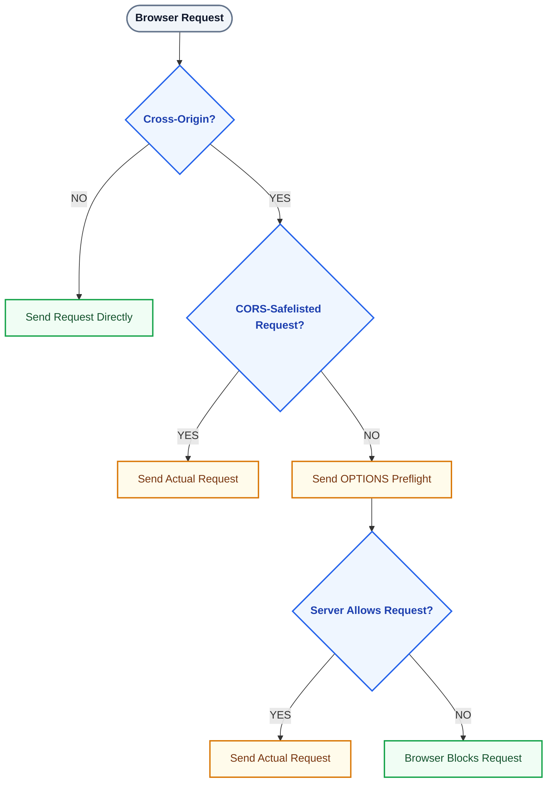

# 🔐 CORS (Cross-Origin Resource Sharing)

## What it is

Browser-level security that controls which origins can call your API.

## Why it matters

- Restricts which websites can make requests to your API.
- Critical for preventing unauthorized domains from accessing API endpoints.

## Key headers
- Access-Control-Allow-Origin
- Access-Control-Allow-Credentials
- Access-Control-Allow-Methods

## Essential CORS Headers
| **Header**                           | **Purpose**                                                      | **Example**                            |
| ------------------------------------ | ---------------------------------------------------------------- | -------------------------------------- |
| **Access-Control-Allow-Origin**      | Specifies which domains can access this resource                 | `https://yourapp.com` or `*`           |
| **Access-Control-Allow-Methods**     | Specifies which HTTP methods are allowed                         | `GET, POST, PUT, DELETE`               |
| **Access-Control-Allow-Headers**     | Specifies which request headers are allowed                      | `Content-Type, Authorization`          |
| **Access-Control-Allow-Credentials** | Specifies whether cookies/authentication credentials can be sent | `true` *(only with a specific origin)* |
| **Access-Control-Max-Age**           | Specifies how long the browser can cache the preflight response  | `3600` seconds                         |

## Real attack scenario
```
User logged into bank.com
Attacker site evil.com tries to call bank API using cookies
CORS blocks the request in the browser.
```

## Best practices

❌ Never use:
```
Access-Control-Allow-Origin: *
```

**with credentials**  
✅ Allow only trusted domains    
✅ Use preflight validation (OPTIONS)    

## Preflight

A preflight validation request uses the HTTP OPTIONS method. 
Browsers send it automatically before cross-origin requests with custom headers or non-standard methods to check if the server permits the actual action.

**Important**: These apply when the request is cross-origin first. If the frontend and API have the same origin, there is no CORS preflight.

### How CORS Preflight Works
- Trigger: Sent when a request uses methods like PUT or DELETE, or custom headers.Method: Uses the OPTIONS verb.
- Headers: Includes Access-Control-Request-Method and Origin.
- Response: The server replies with allowed methods and origins via headers like Access-Control-Allow-Origin.

| #     | Scenario                               | Preflight?   |
| ----- | -------------------------------------- | ------------ |
| **1** | Cross-origin `GET` with simple headers | ❌ Usually no |
| **2** | Cross-origin `PUT`                     | ✅ Yes        |
| **3** | Cross-origin `PATCH`                   | ✅ Yes        |
| **4** | Cross-origin `DELETE`                  | ✅ Yes        |
| **5** | `Authorization` header                 | ✅ Usually    |
| **6** | `Content-Type: application/json`       | ✅ Usually    |
| **7** | Custom headers (`X-*`)                 | ✅ Usually    |
| **8** | Combination of the above               | ✅ Usually    |

### When can you see OPTIONS preflight?

|      # | Scenario                                                                                                     | Preflight (`OPTIONS`)?              |
| -----: | ------------------------------------------------------------------------------------------------------------ | ----------------------------------- |
|  **1** | Cross-origin request with `Authorization` header                                                             | **Yes**                             |
|  **2** | Cross-origin `POST/PUT/PATCH/DELETE` request                                                                 | **Usually Yes**                     |
|  **3** | Cross-origin `POST` with `Content-Type: application/json`                                                    | **Yes**                             |
|  **4** | Cross-origin request with custom/non-safelisted headers, e.g. `X-API-Key`                                    | **Yes**                             |
|  **5** | Cross-origin request using non-simple methods or headers + credentials requirements                          | **Yes, when CORS rules require it** |
|  **6** | Cross-origin request where the preflight result is not cached                                                | **Yes**                             |
|  **7** | Same-origin request (same protocol + host + port)                                                            | **No**                              |
|  **8** | Cross-origin simple `GET` with safelisted headers                                                            | **No**                              |
|  **9** | Cross-origin simple `POST` using `application/x-www-form-urlencoded`, `multipart/form-data`, or `text/plain` | **No**                              |
| **10** | Cross-origin request whose compatible preflight permission is already cached                                 | **Usually No**                      |

#### 1. Different HTTP method — PUT, PATCH, DELETE
```
DELETE /users/123
```
Usually:
```
OPTIONS /users/123
DELETE  /users/123
```
Because PUT, PATCH, and DELETE are not CORS-safelisted methods.

#### 2. Authorization header

Example:
```
GET /users
Authorization: Bearer <token>
```
Usually:
```
OPTIONS /users
GET     /users
```
This is extremely common in Angular applications using JWT/OAuth.

#### 3. Content-Type: application/json

Example:
```
POST /orders
Content-Type: application/json
```
Usually:
```
OPTIONS /orders
POST    /orders
```
application/json is not a CORS-safelisted content type.

#### 4. Custom request headers

For example:
```
X-Tenant-ID: 123
X-Request-ID: abc
X-API-Key: xyz
```
Then:
```
OPTIONS /orders
POST    /orders
```
The browser asks the server whether these headers are allowed.

#### 5. Multiple non-simple conditions together

For example:
```
PUT /users/123
Authorization: Bearer xxx
Content-Type: application/json
X-Tenant-ID: 100
```
You will typically see:
```
OPTIONS /users/123
PUT     /users/123
```
The preflight essentially asks:
```
Can I send PUT?
Can I send Authorization?
Can I send Content-Type?
Can I send X-Tenant-ID?
```

#### 6. Cross-origin request with credentials in a CORS setup

For example, your frontend:
```
https://app.example.com
```
calls:
```
https://api.example.com
```
and the request uses cookies/credentials.

Depending on the request characteristics, the browser may preflight and the server must respond with appropriate CORS headers such as:
```
Access-Control-Allow-Origin: https://app.example.com
Access-Control-Allow-Credentials: true
```

#### 7. Request headers added by an Angular HTTP interceptor

This is particularly important for your Angular applications.

You might write:
```
intercept(req, next) {
  return next.handle(
    req.clone({
      setHeaders: {
        Authorization: `Bearer ${token}`
      }
    })
  );
}
```
Even if your original code is simply:
```
this.http.get('/users');
```
the actual browser request becomes:

GET /users
Authorization: Bearer xxx

which can cause:
```
OPTIONS /users
GET     /users
```
#### 8. Different origin + request is not a "simple request"

This is the overall rule.

For example:
```
Angular
https://app.example.com
       │
       │ Cross-origin
       ↓
https://api.example.com
       │
       ├── GET + no special headers
       │       ↓
       │      GET                 ← No preflight
       │
       ├── GET + Authorization
       │       ↓
       │      OPTIONS → GET       ← Preflight
       │
       ├── POST + JSON
       │       ↓
       │      OPTIONS → POST      ← Preflight
       │
       └── DELETE
               ↓
              OPTIONS → DELETE    ← Preflight
```



### The one sentence to remember
```
Different origin → CORS applies; non-simple cross-origin request → browser sends OPTIONS preflight.
```
Also remember that preflight results can be cached, so even a request that normally needs preflight may not show OPTIONS every time.


